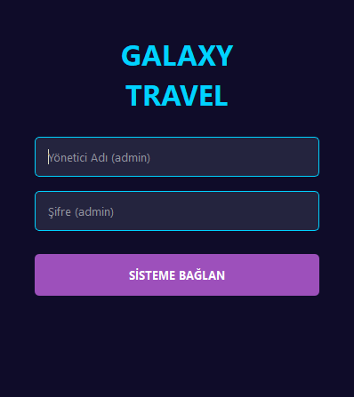
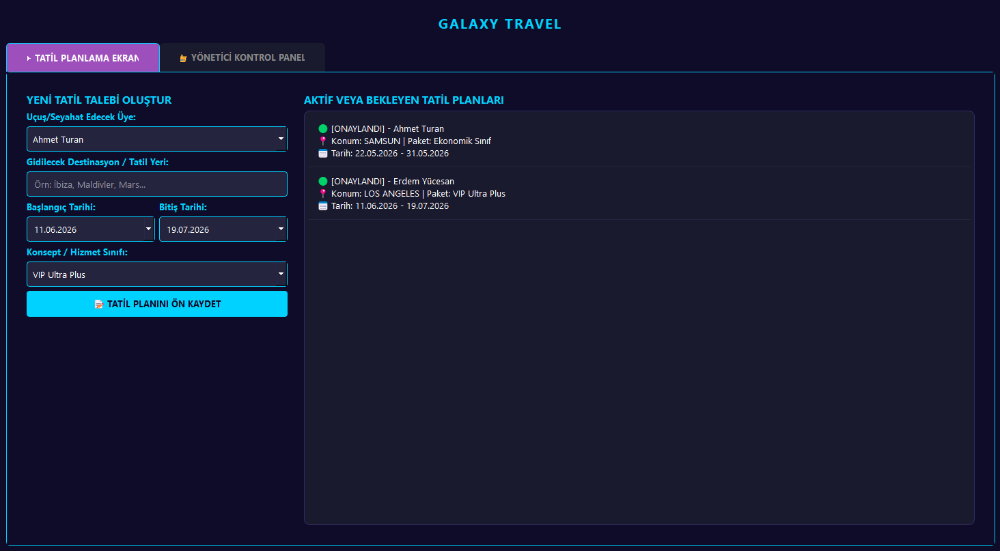
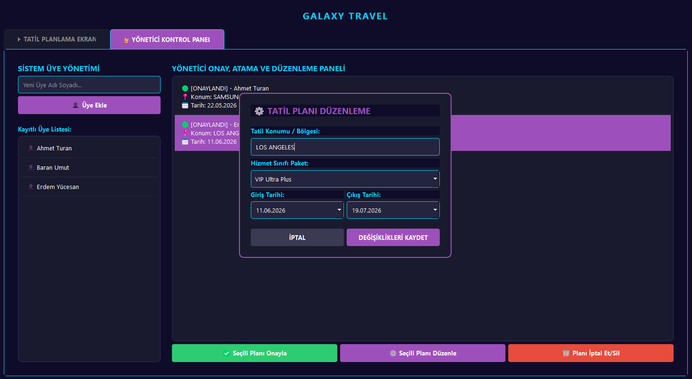

# 🌌 GalaxyTravel | Gelişmiş Uzay Tatili ve Rezervasyon Yönetim Sistemi

GalaxyTravel, bilimkurgu ve uzay temalı (Galaxy Style) özelleştirilmiş bir arayüz tasarımına sahip; kullanıcı profillerini, seyahat rotalarını, paket sınıflarını ve rezervasyon onay süreçlerini uçtan uca yöneten **Python & PyQt5** tabanlı modern bir masaüstü otomasyonudur.

Sistem, ilişkisel veritabanı altyapısı (SQLite3) kullanarak tüm kullanıcı kayıtlarını ve tatil taleplerini yerelde güvenli bir şekilde saklar, yönetici paneliyle de talepleri onaylama/reddetme mekanizması sunar.

---

## ✨ Öne Çıkan Özellikler

* 🔒 **Çift Katmanlı Yetkili Giriş Sistemi:** Hem standart kullanıcılar hem de acente yöneticileri için tasarlanmış şık kimlik doğrulama ekranı.
* 🛰️ **Gezegen ve Konum Kataloğu:** Mars, Jüpiter, Satürn ve Nebula gibi fantastik uzay rotalarının listelendiği görsel ve dinamik arayüz.
* 📅 **Dinamik Planlama ve Paket Seçimi:**
    * Başlangıç ve bitiş tarihlerinin takvim üzerinden dinamik seçimi.
    * Seyahat sınıfı (Ekonomi, İş, VIP Lüks) ve konaklama tercihlerine göre özelleştirilebilir planlama altyapısı.
* 👑 **Yönetici Onay Mekanizması (Admin Panel):** Gelen tatil taleplerini canlı olarak izleme, tek tıkla onaylama (🟢) veya iptal etme (🟡) durum yönetimi.
* 💾 **Akıllı SQLite Altyapısı:** Program ilk kez çalıştırıldığında `uyeler` ve `planlar` tablolarını içeren `tatil.db` veritabanı dosyasını otomatik olarak oluşturur.
* 🎨 **Premium Galaxy UI/UX Tasarımı:** Derin uzay moru, neon mavi ve fütüristik renk paletine sahip, özel QSS (Qt Style Sheets) arayüz kodlamalarıyla donatılmış benzersiz tema.

---

## 📸 Ekran Görüntüleri

### 1. Sistem Giriş Ekranı
Acente yöneticileri ve seyahat severler için tasarlanmış, galaksi temalı fütüristik giriş arayüzü.
> **Varsayılan Giriş Bilgileri:** `Kullanıcı Adı: admin` | `Şifre: admin`



---

### 2. Uzay Rotası Seçimi ve Rezervasyon Paneli
Gezegen konumlarının, seyahat tarihlerinin ve paket sınıflarının seçilerek yeni tatil planlarının oluşturulduğu ana kullanıcı ekranı.



---

### 3. Yönetici Talep Kontrol Merkezi
Acente yöneticilerinin gelen tüm seyahat başvurularını listelediği, onaylama veya iptal süreçlerini yürüttüğü operasyonel yönetim paneli.



---

## 🛠️ Kullanılan Teknolojiler

* **Programlama Dili:** Python 3.x
* **Arayüz Çatısı (GUI):** PyQt5 (QWidgets, QTabWidget, QDateEdit, QComboBox, QListWidget)
* **Veritabanı:** SQLite3 (İlişkisel yerel veritabanı yönetim sistemi)
* **Giriş/Çıkış Yönetimi:** UTF-8 kodlama desteğiyle terminal uyumluluğu (`io.TextIOWrapper`)

---

## 🚀 Kurulum ve Çalıştırma

Projeyi yerel bilgisayarınızda çalıştırmak için aşağıdaki adımları takip edebilirsiniz:

### 1. Depoyu Klonlayın
```bash
git clone [https://github.com/kullanici-adi/GalaxyVoyage.git](https://github.com/kullanici-adi/GalaxyVoyage.git)
cd GalaxyVoyage
